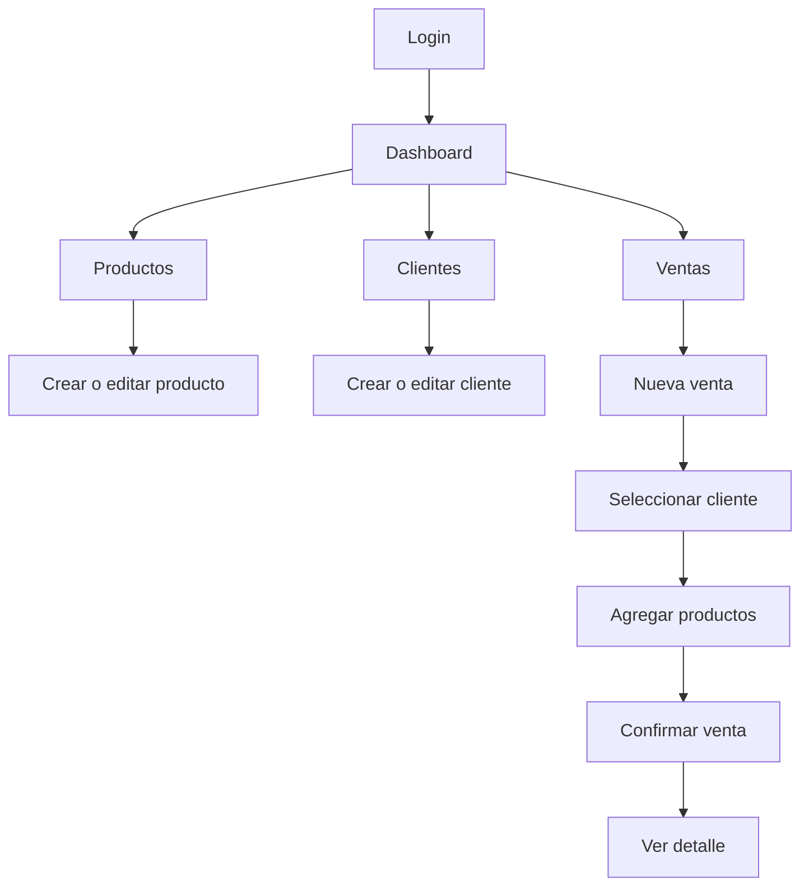

# Disenio Frontend

Guia visual y funcional para construir el frontend del sistema de inventario de herramientas con una interfaz moderna, minimalista y orientada a operacion diaria.

## Objetivo

Crear una aplicacion clara, rapida y facil de usar para gestionar productos, categorias, clientes, ventas y stock. El disenio debe priorizar lectura, accion rapida y consistencia visual.

## Principios De Disenio

- Minimalismo funcional: mostrar solo lo necesario para decidir y actuar.
- Jerarquia clara: metricas, acciones principales y datos criticos deben verse primero.
- Baja friccion: crear productos, clientes y ventas debe requerir pocos pasos.
- Estados visibles: carga, error, vacio, exito y validacion deben tener tratamiento visual.
- Responsive desde el inicio: usable en escritorio, tablet y movil.
- Accesibilidad basica: contraste suficiente, foco visible y textos legibles.

## Personalidad Visual

Estilo recomendado: moderno, sobrio, tecnico y confiable.

Sensacion buscada:

- Ordenado.
- Profesional.
- Ligero.
- Operativo.
- Sin ruido visual.

Evitar:

- Gradientes excesivos.
- Sombras pesadas.
- Colores saturados sin proposito.
- Tablas densas sin jerarquia.
- Pantallas tipo plantilla generica.

## Paleta De Colores

Paleta base minimalista con acentos para estados operativos.

| Uso | Color | Hex |
|---|---|---|
| Fondo principal | Slate 50 | `#f8fafc` |
| Superficie | Blanco | `#ffffff` |
| Superficie secundaria | Slate 100 | `#f1f5f9` |
| Borde suave | Slate 200 | `#e2e8f0` |
| Texto principal | Slate 950 | `#020617` |
| Texto secundario | Slate 500 | `#64748b` |
| Accion primaria | Indigo 600 | `#4f46e5` |
| Accion primaria hover | Indigo 700 | `#4338ca` |
| Exito | Emerald 600 | `#059669` |
| Advertencia | Amber 500 | `#f59e0b` |
| Error | Rose 600 | `#e11d48` |
| Info | Sky 600 | `#0284c7` |

Uso recomendado:

- Usar blanco y slate para el 85% de la interfaz.
- Usar indigo solo para acciones principales.
- Usar amber para stock bajo.
- Usar rose solo para errores o acciones destructivas.
- Usar emerald para confirmaciones y estados completados.

## Tipografia

Fuente recomendada:

- Principal: `Inter`, `system-ui`, `sans-serif`.
- Alternativa si no se instala fuente externa: `system-ui`.

Escala sugerida:

| Token | Tamano | Uso |
|---|---|---|
| `text-xs` | 12px | Badges, labels auxiliares |
| `text-sm` | 14px | Tablas, formularios, texto secundario |
| `text-base` | 16px | Texto general |
| `text-lg` | 18px | Titulos de tarjetas |
| `text-2xl` | 24px | Titulos de pagina |
| `text-3xl` | 30px | Titulos de dashboard |

Pesos:

- 400 para texto normal.
- 500 para labels y navegacion.
- 600 para titulos de seccion.
- 700 para metricas principales.

## Layout General

La aplicacion debe usar una estructura tipo dashboard.

```text
┌─────────────────────────────────────────────┐
│ Header                                      │
├───────────────┬─────────────────────────────┤
│ Sidebar       │ Contenido principal         │
│               │                             │
│ Navegacion    │ Paginas / tablas / forms    │
│               │                             │
└───────────────┴─────────────────────────────┘
```

Desktop:

- Sidebar fijo de 260px.
- Header superior de 64px.
- Contenido con maximo visual de 1440px.
- Padding principal de 24px o 32px.

Tablet:

- Sidebar colapsable.
- Header conserva buscador y usuario.
- Tarjetas en 2 columnas.

Movil:

- Sidebar como drawer.
- Header compacto.
- Tablas convertidas a cards.
- Acciones principales visibles como botones full width cuando aplique.

## Navegacion

Items principales:

- Dashboard.
- Productos.
- Categorias.
- Clientes.
- Ventas.
- Reportes.
- Configuracion.

Reglas:

- El item activo debe tener fondo suave `#eef2ff` y texto indigo.
- Los iconos deben ser lineales y discretos.
- No usar mas de 7 items visibles en navegacion principal.
- Acciones criticas no deben vivir solo en menus ocultos.

## Pantallas Principales

### Login

Objetivo: entrada clara y confiable al sistema.

Layout:

- Panel centrado con ancho maximo de 420px.
- Fondo `#f8fafc`.
- Tarjeta blanca con borde sutil.
- Logo o nombre del sistema arriba.
- Inputs grandes y legibles.
- Boton primario full width.

Contenido:

- Titulo: `Acceso al inventario`.
- Subtitulo: `Gestiona productos, clientes y ventas desde un solo lugar.`
- Campos: email, password.
- Acciones: ingresar, recuperar acceso si aplica.

Estados:

- Error de credenciales debajo del formulario.
- Loading en boton con texto `Ingresando...`.
- Validacion antes de enviar.

### Dashboard

Objetivo: resumen operativo inmediato.

Bloques:

- Total de productos.
- Productos con stock bajo.
- Ventas del dia.
- Total vendido.
- Ultimas ventas.
- Productos con menor stock.

Layout desktop:

```text
┌──────────────┬──────────────┬──────────────┬──────────────┐
│ KPI          │ KPI          │ KPI          │ KPI          │
├──────────────┴──────────────┬──────────────┴──────────────┤
│ Ventas recientes            │ Stock bajo                   │
└─────────────────────────────┴─────────────────────────────┘
```

Reglas visuales:

- KPIs en tarjetas limpias.
- Usar icono pequeno y color contextual.
- Numeros grandes, etiquetas pequenas.
- Stock bajo con acento amber.

### Productos

Objetivo: consultar y mantener inventario.

Elementos:

- Header de pagina con titulo y boton `Nuevo producto`.
- Barra de busqueda.
- Filtros por categoria y stock.
- Tabla de productos.
- Acciones por fila: ver, editar, eliminar.

Columnas sugeridas:

- Nombre.
- Categoria.
- Precio.
- Stock.
- Estado.
- Actualizado.
- Acciones.

Estados de stock:

- `Disponible`: stock normal, badge emerald.
- `Stock bajo`: stock menor o igual al minimo definido, badge amber.
- `Agotado`: stock igual a 0, badge rose.

Formulario producto:

- Nombre.
- Descripcion.
- Categoria.
- Precio.
- Stock.
- Guardar.
- Cancelar.

### Categorias

Objetivo: organizar productos sin complejidad.

Elementos:

- Listado simple.
- Nombre.
- Descripcion.
- Cantidad de productos asociada si el backend lo soporta.
- Acciones: editar, eliminar.

Regla:

- Si una categoria tiene productos asociados, la eliminacion debe mostrar confirmacion clara o bloquearse segun API.

### Clientes

Objetivo: gestionar datos de compradores.

Elementos:

- Busqueda por identificacion, nombres o email.
- Tabla o cards en movil.
- Boton `Nuevo cliente`.

Campos:

- Identificacion.
- Nombres.
- Apellidos.
- Email.
- Telefono.
- Direccion.

Validaciones UI:

- Email valido.
- Campos requeridos visibles.
- Mensajes debajo de cada input.

### Ventas

Objetivo: registrar ventas con control de stock.

Pantalla listado:

- Fecha.
- Cliente.
- Total.
- Cantidad de items.
- Acciones: ver detalle, anular/eliminar si aplica.

Pantalla nueva venta:

```text
┌───────────────────────────────┬───────────────────────────┐
│ Seleccion de cliente          │ Resumen                   │
│ Busqueda de productos         │ Subtotal                  │
│ Tabla de items                │ Total                     │
│ Cantidad / precio / subtotal  │ Confirmar venta           │
└───────────────────────────────┴───────────────────────────┘
```

Reglas UX:

- No permitir confirmar sin cliente.
- No permitir confirmar sin productos.
- No permitir cantidades mayores al stock disponible.
- Mostrar stock disponible antes de agregar producto.
- Actualizar total en tiempo real.
- Confirmacion visual al guardar venta.

### Reportes

Objetivo: lectura rapida de informacion comercial.

Primera version:

- Ventas por rango de fecha.
- Productos mas vendidos.
- Productos con stock bajo.
- Total vendido.

Visualizacion:

- Usar tablas y KPIs primero.
- Agregar graficas solo cuando aporten valor.

## Componentes UI

Componentes base:

- `Button`.
- `Input`.
- `Select`.
- `Textarea`.
- `Badge`.
- `Card`.
- `Table`.
- `Modal`.
- `ConfirmDialog`.
- `Toast`.
- `EmptyState`.
- `Spinner`.
- `PageHeader`.
- `MetricCard`.
- `Sidebar`.
- `Header`.

Variantes de boton:

| Variante | Uso |
|---|---|
| Primary | Accion principal de la pantalla |
| Secondary | Accion alternativa |
| Ghost | Acciones discretas |
| Danger | Eliminar o anular |

Reglas de componentes:

- Altura minima de inputs y botones: 40px.
- Radio de borde: 10px o 12px.
- Borde: `1px solid #e2e8f0`.
- Focus ring visible: `0 0 0 3px #c7d2fe`.
- Evitar sombras fuertes. Usar sombra ligera solo en tarjetas elevadas.

## Estados Visuales

Loading:

- Skeleton para tablas y tarjetas.
- Spinner pequeno dentro de botones.
- Evitar pantallas completamente vacias durante carga.

Empty:

- Icono simple.
- Mensaje claro.
- Accion primaria si aplica.

Ejemplo:

```text
No hay productos registrados.
Crea el primer producto para empezar a controlar tu inventario.
[Nuevo producto]
```

Error:

- Mensaje corto.
- Accion de reintentar.
- No mostrar errores tecnicos crudos al usuario.

Exito:

- Toast breve.
- No interrumpir el flujo si no es necesario.

Confirmacion destructiva:

- Modal con titulo claro.
- Texto explicando consecuencia.
- Boton danger.
- Boton cancelar visible.

## Formularios

Patron recomendado:

- Labels siempre visibles.
- Placeholder solo como ejemplo, no como label.
- Error debajo del campo.
- Campos requeridos marcados de forma discreta.
- Acciones al final alineadas a la derecha en desktop y full width en movil.

Orden de acciones:

- Cancelar.
- Guardar.

Validaciones:

- Validar requerido antes de enviar.
- Validar formato de email.
- Validar numeros positivos para precio, stock y cantidad.
- Mostrar errores devueltos por API en contexto.

## Tablas

Reglas:

- Header con fondo `#f8fafc`.
- Filas con hover suave.
- Acciones al final.
- No saturar columnas.
- Usar badges para estados.
- En movil, convertir filas en cards.

Acciones por fila:

- Ver detalle si aplica.
- Editar.
- Eliminar con confirmacion.

## Responsive

Breakpoints sugeridos:

| Breakpoint | Ancho | Uso |
|---|---|---|
| Mobile | `< 640px` | Drawer, cards, botones full width |
| Tablet | `640px - 1024px` | Sidebar colapsable, grids de 2 columnas |
| Desktop | `> 1024px` | Sidebar fijo, tablas completas |

Reglas:

- No depender de hover para acciones criticas.
- Tablas deben tener alternativa mobile.
- Formularios largos pueden dividirse en secciones.
- El boton principal debe ser facil de alcanzar en mobile.

## Accesibilidad

Minimos obligatorios:

- Contraste AA para texto principal.
- Navegacion por teclado.
- Focus visible.
- Inputs con `label` asociado.
- Botones con texto claro.
- Iconos decorativos con `aria-hidden`.
- Mensajes de error conectados al campo.
- No usar color como unica senal de estado.

## Estructura Frontend Recomendada

```text
frontend-app/src/
  app/
    App.tsx
    routes.tsx
  components/
    layout/
      AppShell.tsx
      Header.tsx
      Sidebar.tsx
    ui/
      Button.tsx
      Card.tsx
      Input.tsx
      Table.tsx
      Badge.tsx
      Modal.tsx
      Toast.tsx
  features/
    auth/
      LoginPage.tsx
      auth.service.ts
      auth.types.ts
    dashboard/
      DashboardPage.tsx
    productos/
      ProductsPage.tsx
      ProductForm.tsx
      products.service.ts
      products.types.ts
    categorias/
      CategoriesPage.tsx
    clientes/
      ClientsPage.tsx
      ClientForm.tsx
    ventas/
      SalesPage.tsx
      NewSalePage.tsx
      SaleDetailPage.tsx
  hooks/
  services/
    api.ts
  styles/
    tokens.css
    globals.css
  types/
  main.tsx
```

## Tokens CSS Sugeridos

```css
:root {
  --color-bg: #f8fafc;
  --color-surface: #ffffff;
  --color-surface-muted: #f1f5f9;
  --color-border: #e2e8f0;
  --color-text: #020617;
  --color-text-muted: #64748b;
  --color-primary: #4f46e5;
  --color-primary-hover: #4338ca;
  --color-success: #059669;
  --color-warning: #f59e0b;
  --color-danger: #e11d48;
  --radius-sm: 8px;
  --radius-md: 12px;
  --radius-lg: 16px;
  --shadow-soft: 0 10px 30px rgba(15, 23, 42, 0.08);
}
```

## Flujo De Usuario Principal



## Criterios De Aceptacion Visual

Una pantalla esta lista si cumple:

- Tiene titulo y accion principal clara.
- Tiene estados de carga, error y vacio.
- Es usable en desktop y mobile.
- No rompe contraste basico.
- Los formularios muestran errores por campo.
- Las acciones destructivas piden confirmacion.
- La UI mantiene espaciado y colores consistentes.
- La pantalla compila con `npm run build`.

## Orden De Implementacion Recomendado

1. Crear tokens visuales y layout base.
2. Crear componentes UI base.
3. Crear login y proteccion de rutas.
4. Crear dashboard con datos mock o API.
5. Crear productos y categorias.
6. Crear clientes.
7. Crear ventas.
8. Crear reportes basicos.
9. Pulir responsive, accesibilidad y estados.

## Resumen

El frontend debe sentirse como una herramienta operativa: limpio, directo y confiable. El enfoque visual debe ser minimalista, con tarjetas claras, tablas legibles, acciones evidentes y un sistema de componentes simple que permita crecer sin perder consistencia.
